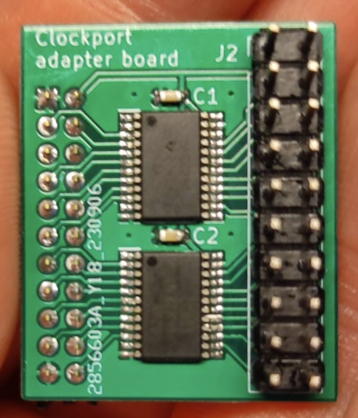

# Clockport adapter board

A simple adapter pcb that connects to the 2 mm clockport connector on an Amiga,
via voltage level converters (5V↔3.3V), to a 2.54 mm pin header.

This can be useful for experimenting with connecting 3.3V devices
to the clockport.

